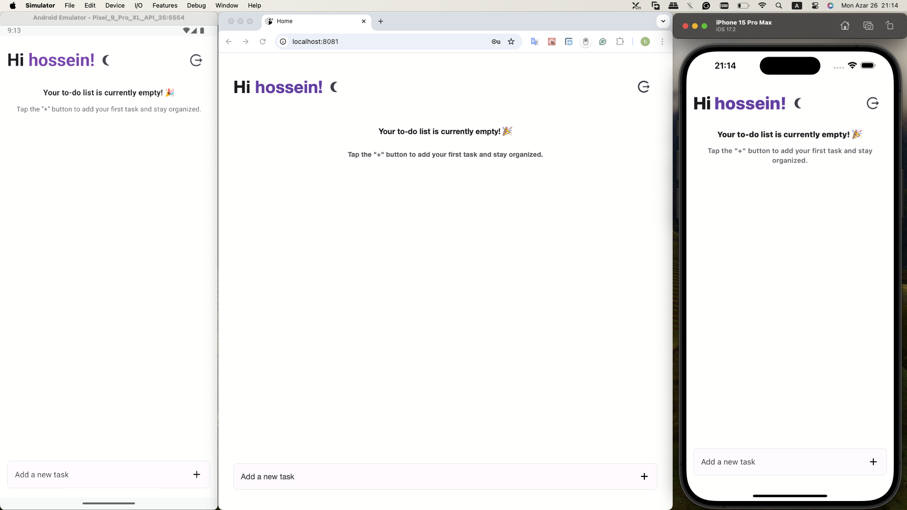
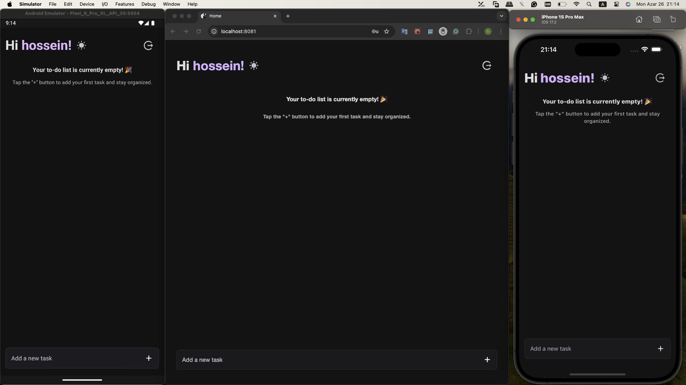

# Go Game Todo Client

## Overview

**Go Game Todo Clinet** is a React Native application designed for managing daily tasks efficiently. Built with modern libraries and tools, it ensures a seamless and responsive user experience. This repository contains the client-side code, written in TypeScript, and leverages Expo for easy development and deployment.

### [Go Game Server (Backend)](https://github.com/Mhp23/go-game-server/)


<br />


## Features

- Simple and clean user interface.
- Scalable architecture for easy maintenance and growth.
- Dark and light mode support.
- Cross-platform compatibility (Android, iOS, and Web).

## Prerequisites

Ensure you have the following installed:

- Node.js (>= 18.x)
- pnpm (`npm install -g pnpm`)
- Android Studio/Xcode (for running on physical devices/emulators)

## Installation

1. Clone the repository:

   ```bash
   git clone https://github.com/Mhp23/go-game-client.git
   cd go-game-client
   ```

2. Install dependencies:

   ```bash
   pnpm install
   ```

3. Set up environment variables:

   Create a `.env` file in the root of the project and configure it like the following template:

   ```env
   EXPO_PUBLIC_BASE_URL=http://localhost:<PORT>/api
   EXPO_PUBLIC_ANDROID_BASE_URL=http://10.0.2.2:<PORT>/api
   ```

4. Run the app on your desired platform:

   - Android: `pnpm android`
   - iOS: `pnpm ios`
   - Web: `pnpm web`

## Scripts

- `start`: Starts the Expo development server.
- `android`: Builds and runs the app on an Android emulator or device.
- `ios`: Builds and runs the app on an iOS emulator or device.
- `web`: Starts the app in a web browser.
- `lint`: Lints the codebase using ESLint.
- `prepare`: Prepares Husky for managing Git hooks.
- `pre-commit`: Runs lint-staged tasks before committing.

## Core Libraries

### UI/UX

- **[expo-vector-icons](https://docs.expo.dev/guides/icons/)**: Prebuilt icons from popular icon packs.
- **[react-native-paper](https://callstack.github.io/react-native-paper/)**: Material Design components for React Native.
- **[@gorhom/bottom-sheet](https://github.com/gorhom/react-native-bottom-sheet)**: Modern bottom sheet implementation.
- **[react-native-full-responsive](https://github.com/Mhp23/react-native-full-responsive)**: For seamless cross-platform responsiveness.

### State Management

- **[@reduxjs/toolkit](https://redux-toolkit.js.org/)**: Simplified state management with Redux.
- **[react-redux](https://react-redux.js.org/)**: React bindings for Redux.

### Form Handling

- **[react-hook-form](https://react-hook-form.com/)**: Performant and flexible form handling.
- **[zod](https://github.com/colinhacks/zod)**: Schema validation library integrated with `react-hook-form`.

### Navigation

- **[@react-navigation/native](https://reactnavigation.org/)**: Routing and navigation.
- **[@react-navigation/native-stack](https://reactnavigation.org/docs/stack-navigator/)**: Stack navigator for screen management.

### Performance

- **[react-native-mmkv](https://github.com/mrousavy/react-native-mmkv)**: High-performance key-value storage.
- **[expo-secure-store](https://docs.expo.dev/versions/latest/sdk/securestore/)**: Secure storage for sensitive data.

### Animations and Gestures

- **[react-native-reanimated](https://docs.swmansion.com/react-native-reanimated/)**: Advanced animations and interactions.
- **[react-native-gesture-handler](https://docs.swmansion.com/react-native-gesture-handler/)**: Gesture handling library for touch interactions.

### Network

- **[@react-native-community/netinfo](https://github.com/react-native-netinfo/react-native-netinfo)**: Internet connection monitoring.

## Development Tools

- **[ESLint](https://eslint.org/)**: JavaScript/TypeScript linting.
- **[Prettier](https://prettier.io/)**: Code formatter.
- **[Husky](https://typicode.github.io/husky/#/)**: Git hooks manager.
- **[lint-staged](https://github.com/okonet/lint-staged)**: Run linters on staged files.
- **[TypeScript](https://www.typescriptlang.org/)**: Typed JavaScript.

## Contributing

1. Fork the repository.
2. Create a feature branch (`git checkout -b feature/my-feature`).
3. Commit your changes (`git commit -m 'Add my feature'`).
4. Push to the branch (`git push origin feature/my-feature`).
5. Open a pull request.

## Issues

Report issues [here](https://github.com/Mhp23/go-game-client/issues).

## License

This project is licensed under the MIT License. See the [LICENSE](LICENSE) file for details.

---

Happy coding!
